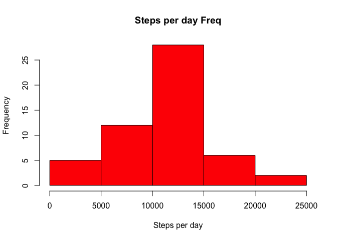
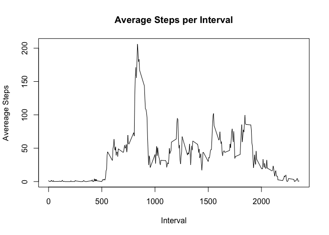
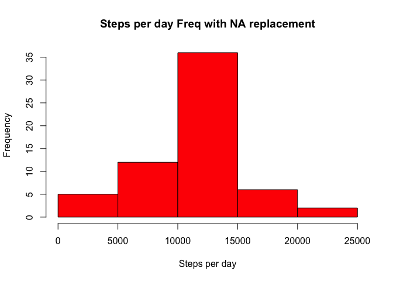
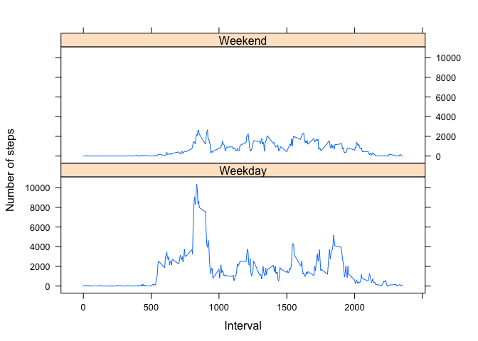

# Reproducible Research: Peer Assessment 1
rod termaat  
November 10, 2014  

##Loading and preprocessing the data.
###1. Load the data (ie. read.csv( ))

```r
dat <- read.csv("./activity.csv")
```


###2. Process/transform the data (if necessary) into a format suitable for your analysis
The process of loading and preprocessing the data requires that the activity.csv 
be available in the working directory of your script.


```r
##install.packages("dplyr", dependencies=TRUE)
## this package is used to summarize and group data for analysis
library(dplyr)
```

```
## 
## Attaching package: 'dplyr'
## 
## The following object is masked from 'package:stats':
## 
##     filter
## 
## The following objects are masked from 'package:base':
## 
##     intersect, setdiff, setequal, union
```

```r
dat1 <- filter(dat, steps!='NA')  ## remove NA values
dat2 <- summarise(group_by(dat1, date), sum(steps)) ## group by date and sum steps by date
names(dat2)[names(dat2)=="sum(steps)"] <- "steps"
```


##What is mean total number of steps per day?
###1. Make a histogram of the total number of steps taken each day

```r
## create histogram of freq of steps banded by day

hist(dat2$'steps',
     col="red",
     xlab="Steps per day",
     main="Steps per day Freq")
```

 

```r
dat_mean <- round(mean(dat2$steps),2)
dat_med <- median(dat2$steps)
```

###2. Calculate and report the mean and median total number of steps taken per day


```r
dat_mean <- round(mean(dat2$steps),2)
dat_med <- median(dat2$steps)
```
####Answer:
The average (mean) number of steps total per day is 1.0766 &times; 10<sup>4</sup> and the median is 10765.


##What is the average daily activity pattern?
###1. Make a time series plot (i.e. type = "l") of the 5-minute interval (x-axis) and the average number of steps taken, averaged across all days (y-axis)


```r
dat_interval <- summarise(group_by(dat1, interval), mean(steps))
plot(dat_interval$interval, dat_interval$'mean(steps)', type="l", xlab="Interval", ylab="Avereage Steps")
title(main = "Average Steps per Interval")
```

 

###2. Which 5-minute interval, on average across all the days in the dataset, contains the maximum number of steps?


```r
names(dat_interval)[names(dat_interval)=="mean(steps)"] <- "steps"
dat_interval2 <- arrange(dat_interval, desc(steps))
big_interval <- dat_interval2$interval[1]
big_value <- round(dat_interval2$steps[1], 2)
```

####Answer:
The 5-minute interval containing the maximum number of steps is interval 835 and the number of steps is 206.17.


##Imputing missing values
Note that there are a number of days/intervals where there are missing values (coded as NA). The presence of missing days may introduce bias into some calculations or summaries of the data.

###1. Calculate and report the total number of missing values in the dataset (i.e. the total number of rows with NAs)


```r
dat_na <- filter(dat, is.na(steps))
```

####Answer:
The total missing step values is 2304.

###2. Devise a strategy for filling in all of the missing values in the dataset. The strategy does not need to be sophisticated. For example, you could use the mean/median for that day, or the mean for that 5-minute interval, etc.

###3. Create a new dataset that is equal to the original dataset but with the missing data filled in.

####Answer:  
create a data frame with only NA values. create another data frame with the mean steps by interval. combine the data and select the appropriate values allowing you to rbind with the data set created with no NA values.  This creates a data frame equal to the original but with NA's replaced by the mean step for that interval


```r
##clean up of the funky name dplyr creates
names(dat_na)[names(dat_na)=="steps"] <- "nosteps"
## determine the mean by interval
dat_mean_int <- summarise(group_by(dat1, interval), round(mean(steps),0))

## join the mean interval with NA records on 
dat_na_join <- inner_join(dat_na, dat_mean_int, by='interval')
names(dat_na_join)[names(dat_na_join)=="round(mean(steps), 0)"] <- "steps"
dat_na_join2 <- select(dat_na_join, steps, date, interval)
dat_na_final <- rbind(dat_na_join2,dat1)
```

###4. Make a histogram of the total number of steps taken each day and Calculate and report the mean and median total number of steps taken per day. Do these values differ from the estimates from the first part of the assignment? What is the impact of imputing missing data on the estimates of the total daily number of steps?


```r
dat_no_NA <- summarise(group_by(dat_na_final, date), sum(steps))
names(dat_no_NA)[names(dat_no_NA)=="sum(steps)"] <- "steps"

hist(dat_no_NA$'steps',
     col="red",
     xlab="Steps per day",
     main="Steps per day Freq with NA replacement")
```

 

```r
dat_mean_no_NA <- round(mean(dat_no_NA$steps),2)
dat_med_no_NA <- median(dat_no_NA$steps)
```
####Answer:
NA values removed from analysis
The average (mean) number of steps total per day is 1.0766 &times; 10<sup>4</sup> and the median is 10765.

NA values replaced with mean steps
The average (mean) number of steps total per day is 1.0766 &times; 10<sup>4</sup> and the median is 1.0762 &times; 10<sup>4</sup>.

This is as expected as the mean steps are reinforced by introducing additional mean values for previous NA values.  The median is slightly lower as expected since the average values naturally appear in the center of the range thereby decreasing the calculated median.

##Are there differences in activity patterns between weekdays and weekends?

For this part the weekdays() function may be of some help here. Use the dataset with the filled-in missing values for this part.

###Create a new factor variable in the dataset with two levels – “weekday” and “weekend” indicating whether a given date is a weekday or weekend day.

First we will create a new column containing the day of the week and then we will replace the day with weekday and weekend.  Not real elegant, but does the job.


```r
dat_weekday <- mutate(dat_na_final, weekday = weekdays(as.Date(date)))
dat_weekday$weekday[which(dat_weekday$weekday=="Monday")]<-"Weekday"
dat_weekday$weekday[which(dat_weekday$weekday=="Tuesday")]<-"Weekday"
dat_weekday$weekday[which(dat_weekday$weekday=="Wednesday")]<-"Weekday"
dat_weekday$weekday[which(dat_weekday$weekday=="Thursday")]<-"Weekday"
dat_weekday$weekday[which(dat_weekday$weekday=="Friday")]<-"Weekday"
dat_weekday$weekday[which(dat_weekday$weekday=="Saturday")]<-"Weekend"
dat_weekday$weekday[which(dat_weekday$weekday=="Sunday")]<-"Weekend"
```

###Make a panel plot containing a time series plot (i.e. type = "l") of the 5-minute interval (x-axis) and the average number of steps taken, averaged across all weekday days or weekend days (y-axis). See the README file in the GitHub repository to see an example of what this plot should look like using simulated data.

First we group the dat_weekday data frame by weekday and interval with the mean(steps)
Then we plot the data using some the lattice ploting package.


```r
library(lattice)

dat_weekday_summary <- summarise(group_by(dat_weekday, weekday, interval), sum(steps))
names(dat_weekday_summary)[names(dat_weekday_summary)=="sum(steps)"] <- "steps"

xyplot(steps ~ interval| weekday, 
       data = dat_weekday_summary,
       type = "l",
       xlab = "Interval",
       ylab = "Number of steps",
       layout=c(1,2))
```

 
